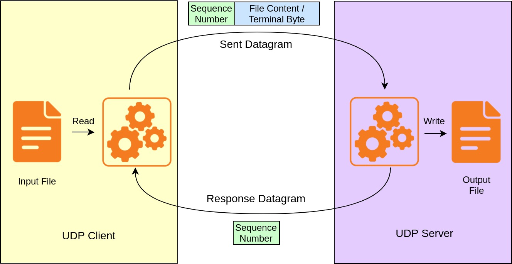

# Simple File Server

[](https://github.com/ballerina-platform/module-ballerina-udp)

_Authors_: @shafreenAnfar @Maninda   
_Reviewers_: @shafreenAnfar   
_Created_: 2021/12/10   
_Updated_: 2021/12/14 

## Overview

This guide explains how to add and retrieve a file to/from a UDP server using Ballerina.
This example explains how to write a simple file server using UDP. The server only supports sending and receiving files. The figure below illustrates the high-level design diagram of the server.

<div align="center"></div>

## Implementation

File transfer via UDP is implemented as described below.
- Initially, the UDP server is listening to the same port on which the UDP client is configured.
- Both the client and the server maintain a `sequenceNo` counter for the sequence number for each of the data-sending events.
    - `sequenceNo` is a byte initialized at 0 and increments by 1 up to 255, and starts again from 0.
    - `sequenceNo` byte is prepended to the data sent from the client.
    - When the data is to be sent, the client increments the `sequenceNo` and sends to the server.
    - Once the server consumes the data by writing them to a file, it returns the same `sequenceNo` back to the client.
    - The client waits up to 10 seconds (loop of 1 second checks) to receive that `sequenceNo` from the server.
        - If the client receives the same `sequenceNo` from the server, it sends the next amount of data to the server.
        - Otherwise, the client exits the program printing an error message.
- When the client finds the end of the file to be read, it sends the last datagram replacing the file content of the data with the `TERMINAL` byte, which has the value `14`.
- Then, the client closes both the datagram client and the file reader.
- Once the server detects the `TERMINAL` byte, it also closes the file writer.

## Execution Order

The below are the detailed explanations of each of the steps of this example.

### Step 1 - Start the UDP Server

Execute the run command of the Ballerina server project of the sample UDP server. This would start the UDP server.

### Step 2 - Initialize the UDP Client with Credentials

In order to interact with a UDP server, a UDP Client has to be initialized with the server-related connection details and user's credentials. The Ballerina UDP client is configured to run on the port `20211` of `localhost`.

### Step 3 - Send the File

A blocked stream of bytes of the local file is created and passed to the UDP client along with the destination path name.
Then, the file is stored in the UDP file server.

### Step 4 - Close the File Stream

When all the file-related operations are finished, the byte stream corresponding to the received file is closed.

## Testing

You can run the above code in your local environment. Navigate to the directory
[`examples/simple-file-server/server`](./server), and execute the command below.
```shell
$ bal run
```

The successful execution of the server should show the output below.
```shell
Compiling source
	udp/udp_file_server:1.0.0

Running executable
```

Then, navigate to the [`examples/simple-file-server/client`](./client) directory, and execute the command below.
```shell
$ bal run
```

The successful execution of the client should show the output below.
```shell
Compiling source
	udp/udp_file_client:1.0.0

Running executable
```

Now, check the current directory for the received file. The dest.txt` file should be available.
